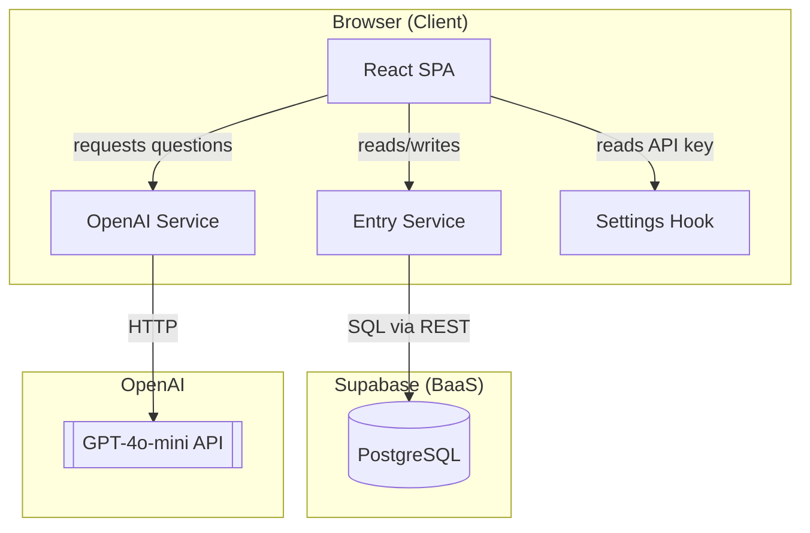
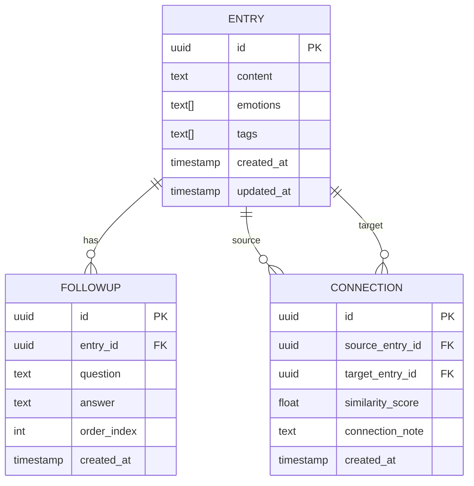
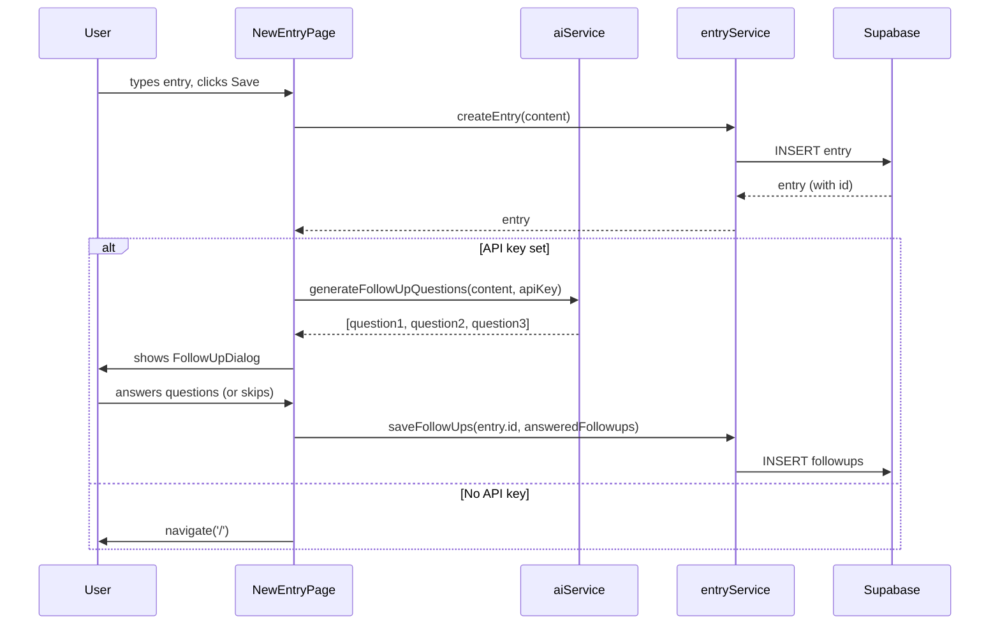
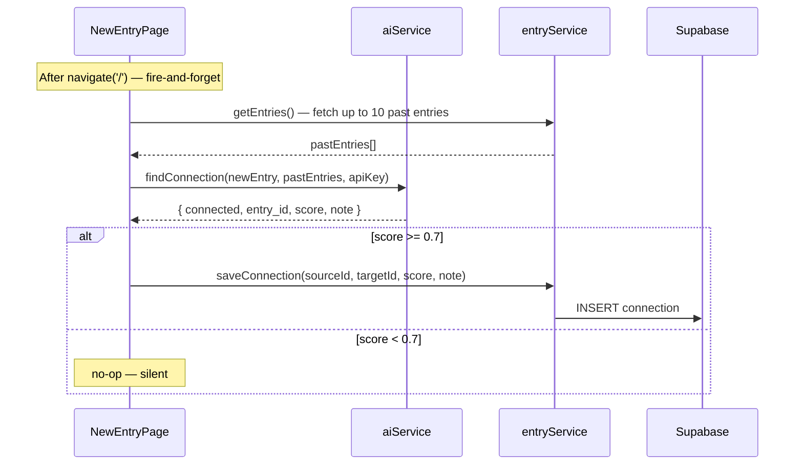
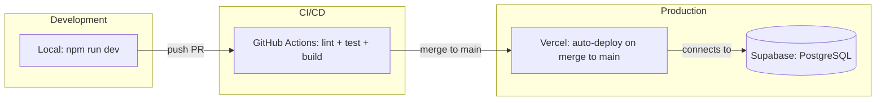

# Dotflow - Architecture Documentation

**Version:** 2.0
**Date:** 2026-04-25
**Author:** Solution Architect
**Status:** Updated after US-103

---

## 1. Architecture Overview (High-Level)



**Key Architecture Decisions:**
- **No backend server:** All logic runs in the browser. Supabase is the database, OpenAI is the AI. No Node.js server needed for MVP.
- **Single-user MVP:** No authentication. Supabase Row Level Security disabled. One Supabase project = one user.
- **API key in localStorage:** User provides their own OpenAI API key via Settings screen. Never sent to any server other than OpenAI.

---

## 2. Data Model — Entity Relationship Diagram (ERD)



**Notes:**
- `ENTRY.emotions` — array of detected/confirmed emotion tags (e.g., ["frustrated", "hopeful"])
- `ENTRY.tags` — array of topic tags (e.g., ["work", "relationship", "decision"])
- `CONNECTION.similarity_score` — 0.0 to 1.0, computed by AI when new entry is created
- `CONNECTION.connection_note` — AI-generated sentence explaining why entries are connected

---

## 3. Tech Stack

### Core Technologies

| Layer | Technology | Version | Rationale |
|-------|------------|---------|-----------|
| Frontend | React | 18 | Industry standard, large ecosystem, good for solo dev |
| Build tool | Vite | 5 | Fast HMR, simple config |
| Language | TypeScript | 5 | Type safety, better DX, fewer runtime errors |
| Styling | Tailwind CSS | 3 | Fast prototyping, no CSS files to manage |
| Database | Supabase | latest | PostgreSQL + REST API + realtime, generous free tier |
| AI | OpenAI GPT-4o-mini | latest | Fast, cheap, sufficient for follow-up questions and similarity |
| Hosting | Vercel | - | Zero-config deploy from GitHub, free tier |

### Key Dependencies

| Package | Purpose | Status | Documentation |
|---------|---------|--------|---------------|
| @supabase/supabase-js | Supabase client | ✅ Installed (^2.104.0) | https://supabase.com/docs/reference/javascript |
| openai | OpenAI SDK | ❌ Not used — native fetch used instead | https://platform.openai.com/docs |
| react-router-dom | Client-side routing | ✅ Installed (^7.14.2) | https://reactrouter.com |
| date-fns | Date formatting | ❌ Not used — Intl.DateTimeFormat used instead | https://date-fns.org |
| vitest | Unit testing | ✅ Installed (^2.1.3) | https://vitest.dev |
| @testing-library/react | Component testing | ✅ Installed (^16.0.0) | https://testing-library.com/react |
| @react-three/fiber | React renderer for Three.js — 3D visualization | 📋 Planned (US-201) | https://docs.pmnd.rs/react-three-fiber |
| @react-three/drei | Three.js helpers: OrbitControls, Stars, etc. | 📋 Planned (US-201) | https://docs.pmnd.rs/drei |
| three | Three.js core (peer dep of react-three-fiber) | 📋 Planned (US-201) | https://threejs.org |

---

## 4. Folder Structure

```
dotflow/
├── src/
│   ├── components/          # Reusable UI components
│   │   ├── FollowUpDialog/  # AI follow-up Q&A dialog (US-006)
│   │   │   └── FollowUpDialog.tsx
│   │   ├── EntryCard/       # Entry list card — date, content preview, emotion tags (US-007)
│   │   │   └── EntryCard.tsx
│   │   ├── EntryForm/       # (planned)
│   │   ├── ConnectionBadge/ # "Connected to [date]" badge with navigation (US-101)
│   │   │   └── ConnectionBadge.tsx
│   │   └── PatternSummary/  # Bullet-list display of AI pattern observations (US-102)
│   │       └── PatternSummary.tsx
│   ├── pages/               # Route-level components
│   │   ├── HomePage.tsx     # Home screen: entry list, loading skeleton, empty state, warning banner, connection badges, pattern summary (US-004, US-005, US-007, US-101, US-102)
│   │   ├── NewEntryPage.tsx # Entry writing, AI follow-up dialog orchestration, fire-and-forget connection detection (US-005, US-006, US-101)
│   │   ├── EntryDetailPage.tsx # Full entry view with follow-up Q&A (US-007)
│   │   └── SettingsPage.tsx # API key management screen (US-004)
│   ├── hooks/               # Custom React hooks
│   │   ├── useSettings.ts   # localStorage API key management (US-004)
│   │   ├── useEntries.ts    # (planned)
│   │   └── useAI.ts         # (planned)
│   ├── lib/                 # Third-party client initializations
│   │   └── supabase.ts      # Supabase client (US-002)
│   ├── services/            # External API integrations
│   │   ├── aiService.ts     # OpenAI GPT-4o-mini via native fetch: generateFollowUpQuestions, findConnection, generatePatternSummary (US-006, US-101, US-102)
│   │   └── entryService.ts  # Supabase CRUD: createEntry, getEntries, getEntryById, saveFollowUps, saveConnection, getConnectionsForEntry (US-002, US-006, US-101)
│   ├── types/               # TypeScript type definitions
│   │   └── index.ts         # Entry, FollowUp, Connection, EntryWithFollowUps (US-002)
│   ├── utils/               # Pure utility functions
│   │   └── prompts.ts       # AI prompt templates: FOLLOW_UP_SYSTEM_PROMPT, CONNECTION_SYSTEM_PROMPT, PATTERN_SUMMARY_SYSTEM_PROMPT (US-006, US-101, US-102)
│   ├── __tests__/           # Tests mirror source structure
│   │   ├── setup.ts         # Vitest + jest-dom + RTL cleanup setup
│   │   ├── setup.test.ts    # TC-000: framework smoke test
│   │   ├── components/
│   │   │   ├── ConnectionBadge/
│   │   │   │   └── ConnectionBadge.test.tsx # TC-048–049 (US-101)
│   │   │   ├── EntryCard/
│   │   │   │   └── EntryCard.test.tsx       # TC-035–039 (US-007)
│   │   │   ├── FollowUpDialog/
│   │   │   │   └── FollowUpDialog.test.tsx  # TC-029–034 (US-006)
│   │   │   └── PatternSummary/
│   │   │       └── PatternSummary.test.tsx  # TC-055–056 (US-102)
│   │   ├── hooks/
│   │   │   └── useSettings.test.ts   # TC-019–022 (US-004)
│   │   ├── pages/
│   │   │   ├── HomePage.test.tsx     # TC-002, TC-005, TC-010–011, TC-024, TC-028, TC-050, TC-057–062 (US-004, US-005, US-007, US-101, US-102)
│   │   │   ├── EntryDetailPage.test.tsx # TC-036–039 (US-007)
│   │   │   ├── NewEntryPage.test.tsx # TC-003–009, TC-025–026, TC-034 (US-005, US-006)
│   │   │   └── SettingsPage.test.tsx # TC-001, TC-023 (US-004)
│   │   ├── services/
│   │   │   ├── aiService.test.ts     # TC-010–011, TC-040–043, TC-051–054 (US-006, US-101, US-102)
│   │   │   └── entryService.test.ts  # TC-012–018, TC-044–047 (US-002, US-006, US-101)
│   │   └── utils/
│   │       ├── testHelpers.tsx       # renderWithRouter helper
│   │       └── prompts.test.ts       # TC-063–064: prompt contract tests (US-103)
│   ├── App.tsx              # Root component with BrowserRouter + Routes (US-004, US-005, US-007)
│   ├── index.css            # Tailwind directives
│   ├── main.tsx
│   └── vite-env.d.ts
├── public/
├── docs/                    # Project documentation
├── .claude/
│   └── skills/              # Claude Code agent definitions
├── .github/
│   └── workflows/
│       └── ci.yml           # GitHub Actions CI pipeline (US-003)
├── .env.example
├── .gitignore
├── .prettierrc
├── eslint.config.js         # ESLint v9 flat config
├── index.html
├── package.json
├── postcss.config.js
├── tailwind.config.js       # Tailwind v3
├── tsconfig.json
├── vite.config.ts           # Vitest config (uses vitest/config import)
├── BACKLOG.md
├── CLAUDE.md
└── README.md
```

---

## 5. Component Architecture

### 5.1 NewEntryPage

**Responsibility:** Capture new journal entry text and orchestrate the full entry creation flow (save → AI questions → save follow-ups → background connection detection).

**Flow (US-006 + US-101 entry-first design):**
1. User types entry content
2. User submits — entry saved to Supabase immediately (get `entry.id`)
3. If no API key → navigate('/') directly
4. If API key present → call `aiService.generateFollowUpQuestions(content, apiKey)`
5. On success → render `FollowUpDialog` with questions
6. On AI failure → show error message (entry already saved)
7. User answers/skips → `entryService.saveFollowUps(entry.id, followups)` → navigate('/')
8. **After navigate:** `detectAndSaveConnection()` runs fire-and-forget in background (never blocks UI)

### 5.2 FollowUpDialog

**Responsibility:** Show AI-generated follow-up questions one at a time and collect answers.

**Key behaviors:**
- Maximum 3 questions
- Each question has "Skip" option
- "Ask me more" button (adds up to 2 extra questions)
- Does NOT block — user can always finish

### 5.3 EntryCard

**Responsibility:** Render a single journal entry as a clickable card in the entry list.

**Displays:** formatted date (`Intl.DateTimeFormat`, e.g. "April 15, 2026"), 2-line truncated content preview (`line-clamp-2`), emotion tags as pill badges.

**Props:** `entry: Entry`, `onClick: () => void`

**Note:** Date formatting uses native `Intl.DateTimeFormat` — `date-fns` was not installed to keep the bundle lean.

### 5.4 EntryDetailPage

**Responsibility:** Display the full content of a single entry, its emotion tags, and all answered follow-up questions.

**Flow:**
1. Reads `id` from URL params via `useParams`
2. Calls `getEntryById(id)` on mount
3. Filters follow-ups to `answer !== null` (skipped questions are hidden)
4. "Back" button calls `navigate('/')`

### 5.5 ConnectionBadge

**Responsibility:** Display a subtle "↔ Connected to [date]" button when AI finds a meaningful connection to a past entry. Clicking navigates to the connected entry.

**Props:** `targetId: string`, `targetDate: string` (ISO timestamp)

**Rendering note:** ConnectionBadge is rendered as a sibling element below EntryCard in HomePage — NOT inside EntryCard. This avoids the invalid HTML pattern of nesting `<button>` inside `<button>` (EntryCard's outer element is also a button).

### 5.6 PatternSummary

**Responsibility:** Render a bullet-point list of AI-generated pattern observations.

**Props:** `observations: string[]`

**Key behaviors:**
- Returns `null` when `observations` array is empty — renders nothing
- Renders an `<h2>Your patterns</h2>` heading followed by a `<ul>` of observation items

**Note:** PatternSummary is stateless — all async logic (API call, loading, error) lives in HomePage.

**Data flow:**
- HomePage loads connections in background via `Promise.allSettled` after entries display
- Each entry's `connections[entry.id]` lookup resolves to a `Connection` record
- If found, `targetEntry` is located in the loaded entries array and `ConnectionBadge` is rendered

---

## 6. Data Flow

### 6.1 New Entry Creation



### 6.2 Background Connection Detection (US-101)



**Key design decisions:**
- `findConnection()` never throws — returns `{ connected: false }` fallback on any error
- Entire `detectAndSaveConnection()` function is wrapped in try/catch — silently ignored on failure
- `void` prefix ensures the promise is fire-and-forget, not awaited
- UI is never blocked or shown an error from connection detection

### 6.3 AI Follow-Up Question Generation

**Prompt strategy:** System prompt defines the role. User message contains the entry. AI responds with JSON array of questions. Questions are chosen based on what's MISSING from the entry:
- No emotion mentioned → ask about feelings
- No reflection mentioned → ask "what do you think about this?"
- No context → ask "what led to this?"

---

## 7. Security Considerations

### 7.1 API Key Handling
- OpenAI API key stored in localStorage (client-only)
- Key is sent only to `api.openai.com` — no proxy, no server
- Key is never logged or stored in Supabase
- User is warned in Settings UI: "Your key is stored locally on this device only"

### 7.2 Supabase
- Single-user MVP: RLS disabled, URL and anon key are safe to expose in frontend (standard Supabase pattern for anon key)
- Future: enable RLS + Supabase Auth when multi-user

### 7.3 Data Privacy
- All journal data stored in user's own Supabase project
- Content sent to OpenAI for AI features — user is informed in onboarding

---

## 8. AI Prompt Architecture

All prompts are centralized in `src/utils/prompts.ts`.

### Follow-Up Questions Prompt
```
System: You are a thoughtful journal companion. Your role is to ask 2-3 short, 
open-ended follow-up questions that help the user reflect more deeply. 
Focus on what's MISSING: emotions if not mentioned, opinions if not expressed, 
context if unclear. Never ask more than 3 questions. Respond only with a JSON 
array of question strings.

User: [entry content]
```

### Connection Detection Prompt
```
System: You are analyzing journal entries to find meaningful connections. 
Given a new entry and a list of past entries (max 10), identify if any past 
entry shares a meaningful emotional or situational pattern. Respond with JSON: 
{connected: boolean, entry_id: string|null, score: number, note: string}

User: New entry: [content]
Past entries: [array of {id, content, created_at}]
```

### Pattern Summary Prompt (US-102, US-103)
```
System: You are a thoughtful journal analyst. Analyze the following journal 
entries and identify 3–5 recurring patterns — emotional trends, repeated 
situations, or behavioral triggers the user may not have noticed. 
Respond in the same language as the journal entries.
Respond only with a JSON array of short, empathetic observation strings.

User: [array of entry content strings]
```

**Language handling (US-103):** The prompt explicitly instructs the AI to match the language of the entries. No hardcoded language — AI auto-detects from entry content.

---

## 9. Deployment Architecture



---

## 10. Architecture Decision Records (ADRs)

### ADR-001: No Backend Server

**Date:** 2026-04-09
**Status:** Accepted

**Context:** Solo developer, MVP scope, single user. Adding a backend server adds deployment complexity, cost, and maintenance burden.

**Decision:** Call OpenAI and Supabase directly from the browser.

**Consequences:**
- Positive: Zero backend infrastructure, faster to build, free to run
- Negative: API key visible in browser (acceptable for personal use), future multi-user requires adding a backend proxy

---

### ADR-002: OpenAI User-Supplied API Key

**Date:** 2026-04-09
**Status:** Accepted

**Context:** No backend means no way to hide a shared API key. App is for personal use.

**Decision:** User provides their own OpenAI API key via Settings screen, stored in localStorage.

**Consequences:**
- Positive: No cost to developer, no key management, full user control
- Negative: UX friction (user must have OpenAI account), localStorage cleared = key lost

---

### ADR-003: Supabase over Firebase

**Date:** 2026-04-09
**Status:** Accepted

**Context:** Need a cloud database with sync. Both Firebase and Supabase work.

**Decision:** Supabase — PostgreSQL gives structured relational data (entries + followups + connections), better for complex queries needed for connection detection.

**Consequences:**
- Positive: SQL, proper relations, easy to query connections
- Negative: Slightly more setup than Firebase

---

## 11. Future Considerations

- [ ] **US-201:** 3D star field visualization (react-three-fiber) — M2.5
- [ ] **US-202:** Black hole psychological center, semi-automatic values extraction — M2.5
- [ ] **US-203:** Dialectical insight feedback loop — M2.5
- [ ] User onboarding & instructions — M2.5 (FEATURE-013, US-204)
- [ ] **US-205:** Milestone-triggered adaptive insights — milestone detection, `aiService.generateMilestoneInsight()`, localStorage persistence per milestone (`insight_milestone_10/25/50`), black hole glow/pulse signal, unread state — M2.5
- [ ] Security & privacy messaging — M2.5 (to be discovered)
- [ ] AI communication principles document (`docs/ai_communication_principles.md`) — M2.5 prereq
- [ ] Add Supabase Auth + RLS for multi-user support — M3
- [ ] Add backend proxy for OpenAI (hide API key when multi-user) — M3
- [ ] Add mobile app (React Native, shared logic) — M3
- [ ] Add semantic search using pgvector (Supabase supports this) — future
- [ ] Add weekly reflection summary (cron job via Supabase Edge Functions) — future

---

*This document is updated during /discover sessions when architectural changes are made.*
