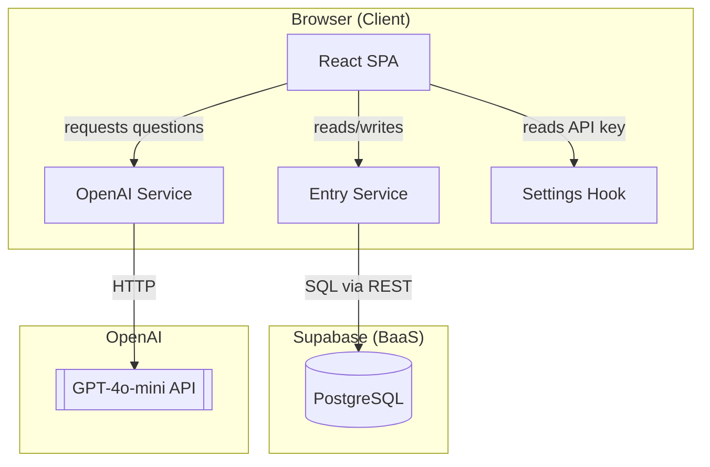
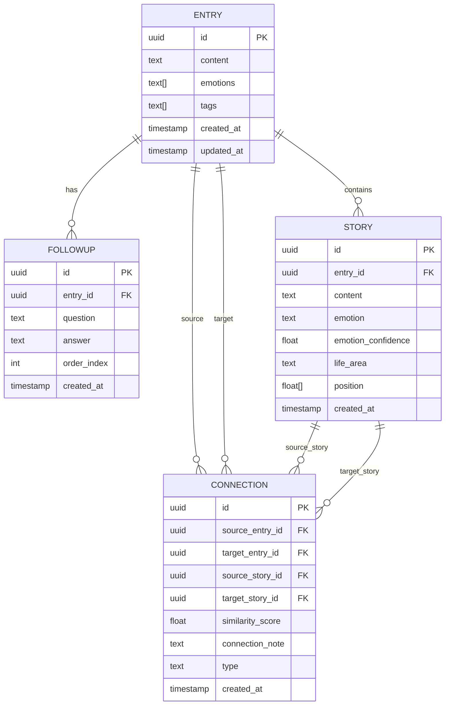
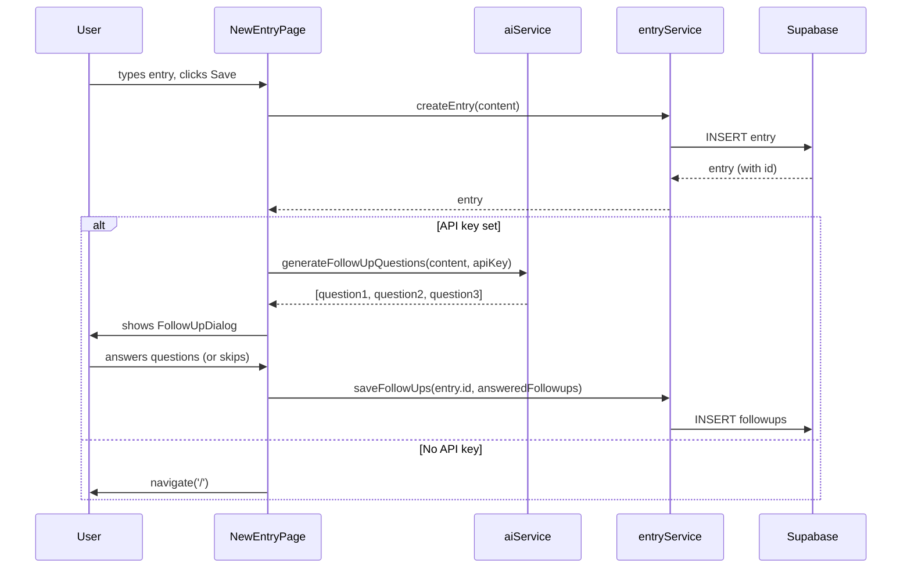
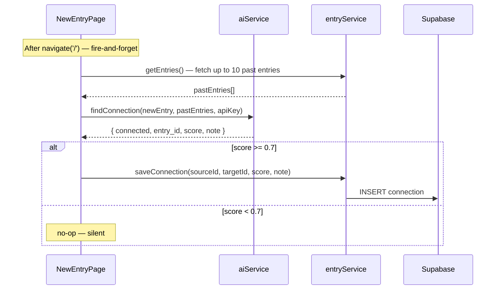
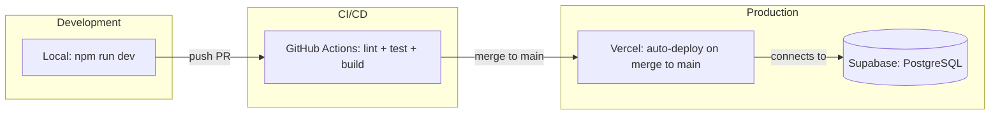

# Dotflow - Architecture Documentation

**Version:** 2.6
**Date:** 2026-05-01
**Author:** Solution Architect
**Status:** Updated after US-210

---

## 1. Architecture Overview (High-Level)



**Key Architecture Decisions:**
- **No backend server:** All logic runs in the browser. Supabase is the database, OpenAI is the AI. No Node.js server needed for MVP.
- **Single-user MVP:** No authentication. Supabase Row Level Security disabled. One Supabase project = one user.
- **API key in localStorage:** User provides their own OpenAI API key via Settings screen. Never sent to any server other than OpenAI.

---

## 2. Data Model — Entity Relationship Diagram (ERD)



**Notes:**
- `ENTRY.emotions` — array of detected/confirmed emotion tags (e.g., ["frustrated", "hopeful"])
- `ENTRY.tags` — array of topic tags (e.g., ["work", "relationship", "decision"])
- `STORY.emotion` — AI-detected primary emotion for this story (e.g., "frustrated", "hopeful")
- `STORY.emotion_confidence` — 0.0 to 1.0; AI confidence in emotion classification; both high and low confidence assigned silently — no UI prompt
- `STORY.life_area` — emergent life area cluster label (AI-suggested, user-renameable, null if area unclear)
- `STORY.position` — stable 3D position [x, y, z] derived from story id hash
- `CONNECTION.source_story_id` / `target_story_id` — story-level connection (null for legacy entry-level connections)
- `CONNECTION.similarity_score` — 0.0 to 1.0, computed by AI when new entry is created
- `CONNECTION.connection_note` — AI-generated sentence explaining why stories are connected
- `CONNECTION.type` — content-based visual type: `"emotional"` (similar emotions), `"thematic"` (similar topic/situation), `"life-choices"` (similar life decisions); no Dilts or psychological labels

---

## 3. Tech Stack

### Core Technologies

| Layer | Technology | Version | Rationale |
|-------|------------|---------|-----------|
| Frontend | React | 18 | Industry standard, large ecosystem, good for solo dev |
| Build tool | Vite | 5 | Fast HMR, simple config |
| Language | TypeScript | 5 | Type safety, better DX, fewer runtime errors |
| Styling | Tailwind CSS | 3 | Fast prototyping, no CSS files to manage |
| Database | Supabase | latest | PostgreSQL + REST API + realtime, generous free tier |
| AI | OpenAI GPT-4o-mini | latest | Fast, cheap, sufficient for follow-up questions and similarity |
| Hosting | Vercel | - | Zero-config deploy from GitHub, free tier |

### Key Dependencies

| Package | Purpose | Status | Documentation |
|---------|---------|--------|---------------|
| @supabase/supabase-js | Supabase client | ✅ Installed (^2.104.0) | https://supabase.com/docs/reference/javascript |
| openai | OpenAI SDK | ❌ Not used — native fetch used instead | https://platform.openai.com/docs |
| react-router-dom | Client-side routing | ✅ Installed (^7.14.2) | https://reactrouter.com |
| date-fns | Date formatting | ❌ Not used — Intl.DateTimeFormat used instead | https://date-fns.org |
| vitest | Unit testing | ✅ Installed (^2.1.3) | https://vitest.dev |
| @testing-library/react | Component testing | ✅ Installed (^16.0.0) | https://testing-library.com/react |
| @react-three/fiber | React renderer for Three.js — 3D visualization | ✅ Installed (^8.18.0, US-201) | https://docs.pmnd.rs/react-three-fiber |
| @react-three/drei | Three.js helpers: OrbitControls, Html, Line | ✅ Installed (^9.122.0, US-201) | https://docs.pmnd.rs/drei |
| three | Three.js core (peer dep of react-three-fiber) | ✅ Installed (^0.184.0, US-201) | https://threejs.org |

---

## 4. Folder Structure

```
dotflow/
├── src/
│   ├── components/          # Reusable UI components
│   │   ├── FollowUpDialog/  # AI follow-up Q&A dialog (US-006)
│   │   │   └── FollowUpDialog.tsx
│   │   ├── EntryCard/       # Entry list card — date, content preview, emotion tags (US-007)
│   │   │   └── EntryCard.tsx
│   │   ├── EntryForm/       # (planned)
│   │   ├── ConnectionBadge/ # "Connected to [date]" badge with navigation (US-101)
│   │   │   └── ConnectionBadge.tsx
│   │   ├── PatternSummary/  # Bullet-list display of AI pattern observations (US-102)
│   │   │   └── PatternSummary.tsx
│   │   ├── StarField/       # 3D star-field visualization (US-201, US-202, US-206–209)
│   │   │   ├── StarField.tsx        # Canvas scene: Camera, OrbitControls, lights, story nodes, session lines, constellation lines, black hole, zone glows
│   │   │   ├── StarNode.tsx         # Legacy entry star mesh (pre-US-206); replaced by StoryNode after story pivot
│   │   │   ├── StoryNode.tsx        # Story star mesh + Html tooltip on hover + "Dopowiedz" elaboration button (US-206)
│   │   │   ├── BlackHole.tsx        # Black hole at origin: pulsing glow halo, hover insight tooltip, entry-count sizing, disagree flow with 2-round AI dialogue (US-202, US-203)
│   │   │   └── ConstellationLines.tsx # Line segments between connected story pairs; typed line styles: solid/dashed/chain (US-209)
│   │   └── ValuesModal/     # Recurring-themes confirmation modal (US-202)
│   │       └── ValuesModal.tsx      # AI-proposed themes: edit/remove/restore, add input, "Żadna z tych" escape hatch
│   ├── pages/               # Route-level components
│   │   ├── HomePage.tsx     # Home screen: entry list, loading skeleton, empty state, warning banner, connection badges, pattern summary, values flow, Write Entry CTA highlight on round limit (US-004, US-005, US-007, US-101, US-102, US-202, US-203)
│   │   ├── NewEntryPage.tsx # Entry writing, AI follow-up dialog orchestration, word count gate (>300 → "Pięknie."), storyContext fetch, fire-and-forget connection detection + story extraction (US-005, US-006, US-101, US-206, US-210)
│   │   ├── EntryDetailPage.tsx # Full entry view with follow-up Q&A (US-007)
│   │   └── SettingsPage.tsx # API key management screen (US-004)
│   ├── hooks/               # Custom React hooks
│   │   ├── useSettings.ts   # localStorage API key management (US-004)
│   │   ├── useUserValues.ts # localStorage confirmed values + proposalDismissed state (US-202)
│   │   ├── useDepthAccumulator.ts # Depth score accumulation + threshold check + localStorage persistence (US-205)
│   │   ├── useLifeAreaZones.ts    # Zone labels + user renames in localStorage (US-208)
│   │   ├── useConnectionFilter.ts # Filter state for 3D connection type visibility (US-209)
│   │   ├── useEntries.ts    # (planned)
│   │   └── useAI.ts         # (planned)
│   ├── lib/                 # Third-party client initializations
│   │   └── supabase.ts      # Supabase client (US-002)
│   ├── services/            # External API integrations
│   │   ├── aiService.ts     # OpenAI GPT-4o-mini via native fetch: generateFollowUpQuestions, findConnection, generatePatternSummary, extractUserValues, respondToInsightFeedback, extractStories, detectEmotionConfidence, classifyLifeArea, classifyConnectionType (US-006, US-101, US-102, US-202, US-203, US-206, US-207, US-208, US-209)
│   │   ├── entryService.ts  # Supabase CRUD: createEntry, getEntries, getEntryById, saveFollowUps, saveConnection, getConnectionsForEntry (US-002, US-006, US-101)
│   │   └── storyService.ts  # Supabase CRUD for stories: saveStories, getStoriesForEntry, getAllStories, addElaboration, updateStoryEmotion, getRecentStories, updateStoryLifeArea (US-206, US-207, US-210, US-208)
│   ├── types/               # TypeScript type definitions
│   │   └── index.ts         # Entry, FollowUp, Connection, EntryWithFollowUps, UserValuesState, Story (US-002, US-202, US-206)
│   ├── utils/               # Pure utility functions
│   │   ├── prompts.ts       # AI prompt templates: FOLLOW_UP_SYSTEM_PROMPT, CONNECTION_SYSTEM_PROMPT, PATTERN_SUMMARY_SYSTEM_PROMPT, USER_VALUES_SYSTEM_PROMPT, DEEPENING_QUESTION_SYSTEM_PROMPT, CLOSING_PHRASE_SYSTEM_PROMPT, STORY_EXTRACTION_SYSTEM_PROMPT, EMOTION_DETECTION_SYSTEM_PROMPT, LIFE_AREA_SYSTEM_PROMPT, CONNECTION_TYPE_SYSTEM_PROMPT (US-006, US-101, US-102, US-202, US-203, US-206, US-207, US-208, US-209)
│   │   ├── starPositions.ts # Deterministic 3D position from entry/story UUID; getAlignedStarPosition() for value-aligned positioning (US-201, US-202, US-206)
│   │   ├── emotionColors.ts # Mapping from emotion string to hex color for star rendering (US-207)
│   │   └── insightConfig.ts # Configurable depth score weights and accumulator threshold (US-205)
│   ├── __tests__/           # Tests mirror source structure
│   │   ├── setup.ts         # Vitest + jest-dom + RTL cleanup setup
│   │   ├── setup.test.ts    # TC-000: framework smoke test
│   │   ├── components/
│   │   │   ├── ConnectionBadge/
│   │   │   │   └── ConnectionBadge.test.tsx # TC-048–049 (US-101)
│   │   │   ├── EntryCard/
│   │   │   │   └── EntryCard.test.tsx       # TC-035–039 (US-007)
│   │   │   ├── FollowUpDialog/
│   │   │   │   └── FollowUpDialog.test.tsx  # TC-029–034 (US-006)
│   │   │   ├── PatternSummary/
│   │   │   │   └── PatternSummary.test.tsx  # TC-055–056 (US-102)
│   │   │   └── ValuesModal/
│   │   │       └── ValuesModal.test.tsx     # TC-072–083: modal render, edit, remove/restore, add theme, escape hatch, confirm (US-202)
│   │   ├── hooks/
│   │   │   ├── useSettings.test.ts   # TC-019–022 (US-004)
│   │   │   └── useUserValues.test.ts # TC-084–091: localStorage read/write, confirmValues, dismissProposal, clearValues (US-202)
│   │   ├── pages/
│   │   │   ├── HomePage.test.tsx     # TC-002, TC-005, TC-010–011, TC-024, TC-028, TC-050, TC-057–062, TC-069–071, TC-092–098 (US-004, US-005, US-007, US-101, US-102, US-201, US-202)
│   │   │   ├── EntryDetailPage.test.tsx # TC-036–039 (US-007)
│   │   │   ├── NewEntryPage.test.tsx # TC-003–009, TC-025–026, TC-034, TC-161–164 (US-005, US-006, US-210)
│   │   │   └── SettingsPage.test.tsx # TC-001, TC-023 (US-004)
│   │   ├── services/
│   │   │   ├── aiService.test.ts     # TC-010–011, TC-040–043, TC-051–054, TC-099–102, TC-107–112, TC-116–122 (US-006, US-101, US-102, US-202, US-203, US-206)
│   │   │   ├── entryService.test.ts  # TC-012–018, TC-044–047 (US-002, US-006, US-101)
│   │   │   └── storyService.test.ts  # TC-123–133, TC-158–160: saveStories, getStoriesForEntry, getAllStories, addElaboration, updateStoryEmotion, getRecentStories (US-206, US-207, US-210)
│   │   └── utils/
│   │       ├── testHelpers.tsx       # renderWithRouter helper
│   │       ├── prompts.test.ts       # TC-063–064, TC-113–115, TC-134–135, TC-165–167: prompt contract tests (US-103, US-203, US-206, US-210)
│   │       └── starPositions.test.ts # TC-065–068, TC-103–106, TC-136–139: deterministic position, radius range, aligned positioning, story position (US-201, US-202, US-206)
│   ├── App.tsx              # Root component with BrowserRouter + Routes (US-004, US-005, US-007)
│   ├── index.css            # Tailwind directives
│   ├── main.tsx
│   └── vite-env.d.ts
├── public/
├── docs/                    # Project documentation
├── .claude/
│   └── skills/              # Claude Code agent definitions
├── .github/
│   └── workflows/
│       └── ci.yml           # GitHub Actions CI pipeline (US-003)
├── .env.example
├── .gitignore
├── .prettierrc
├── eslint.config.js         # ESLint v9 flat config
├── index.html
├── package.json
├── postcss.config.js
├── tailwind.config.js       # Tailwind v3
├── tsconfig.json
├── vite.config.ts           # Vitest config (uses vitest/config import)
├── BACKLOG.md
├── CLAUDE.md
└── README.md
```

---

## 5. Component Architecture

### 5.1 NewEntryPage

**Responsibility:** Capture new journal entry text and orchestrate the full entry creation flow (save → AI questions → save follow-ups → background connection detection).

**Flow (US-006 + US-101 + US-210):**
1. User types entry content
2. User submits — entry saved to Supabase immediately (get `entry.id`)
3. If no API key → navigate('/') directly
4. **Word count gate (US-210):** If word count >300 → show "Pięknie." UI state (inline, not a separate screen) + "Wróć →" button that navigates to `/` — no questions shown
5. If word count ≤300 → fetch recent story context: `getRecentStories(entry.id, 3)` → build `storyContext` string (stories joined by `\n---\n`)
6. Call `aiService.generateFollowUpQuestions(content, apiKey, storyContext?)` with optional context
7. On success → render `FollowUpDialog` with questions
8. On AI failure → show error message (entry already saved)
9. User answers/skips → `entryService.saveFollowUps(entry.id, followups)` → navigate('/')
10. **After navigate:** `detectAndSaveConnection()` runs fire-and-forget in background (never blocks UI)

### 5.2 FollowUpDialog

**Responsibility:** Show AI-generated follow-up questions one at a time and collect answers.

**Key behaviors:**
- Maximum 3 questions
- Each question has "Skip" option
- "Ask me more" button (adds up to 2 extra questions)
- Does NOT block — user can always finish

### 5.3 EntryCard

**Responsibility:** Render a single journal entry as a clickable card in the entry list.

**Displays:** formatted date (`Intl.DateTimeFormat`, e.g. "April 15, 2026"), 2-line truncated content preview (`line-clamp-2`), emotion tags as pill badges.

**Props:** `entry: Entry`, `onClick: () => void`

**Note:** Date formatting uses native `Intl.DateTimeFormat` — `date-fns` was not installed to keep the bundle lean.

### 5.4 EntryDetailPage

**Responsibility:** Display the full content of a single entry, its emotion tags, and all answered follow-up questions.

**Flow:**
1. Reads `id` from URL params via `useParams`
2. Calls `getEntryById(id)` on mount
3. Filters follow-ups to `answer !== null` (skipped questions are hidden)
4. "Back" button calls `navigate('/')`

### 5.5 ConnectionBadge

**Responsibility:** Display a subtle "↔ Connected to [date]" button when AI finds a meaningful connection to a past entry. Clicking navigates to the connected entry.

**Props:** `targetId: string`, `targetDate: string` (ISO timestamp)

**Rendering note:** ConnectionBadge is rendered as a sibling element below EntryCard in HomePage — NOT inside EntryCard. This avoids the invalid HTML pattern of nesting `<button>` inside `<button>` (EntryCard's outer element is also a button).

### 5.6 PatternSummary

**Responsibility:** Render a bullet-point list of AI-generated pattern observations.

**Props:** `observations: string[]`

**Key behaviors:**
- Returns `null` when `observations` array is empty — renders nothing
- Renders an `<h2>Your patterns</h2>` heading followed by a `<ul>` of observation items

**Note:** PatternSummary is stateless — all async logic (API call, loading, error) lives in HomePage.

**Data flow:**
- HomePage loads connections in background via `Promise.allSettled` after entries display
- Each entry's `connections[entry.id]` lookup resolves to a `Connection` record
- If found, `targetEntry` is located in the loaded entries array and `ConnectionBadge` is rendered

### 5.7 StarField (US-201, US-202)

**Responsibility:** Render a 3D visualization of journal entries as stars in space, with constellation lines between connected entries, and a black hole at the center. Lives as a fixed CSS layer on the Home screen; toggled between blurred background mode and interactive 3D mode by clicking the Dotflow logo.

**Components:**
- `StarField.tsx` — Canvas root (`@react-three/fiber`). Sets up Camera (PerspectiveCamera, FOV 60), OrbitControls, ambient light. Renders `<StarNode>` per entry (using aligned positions if values confirmed), `<ConstellationLines>`, and `<BlackHole>`.
- `StarNode.tsx` — `<mesh>` with `sphereGeometry` + `meshBasicMaterial`. On hover: renders `<Html>` overlay showing entry date + 80-char content snippet.
- `BlackHole.tsx` — Sphere mesh at origin `[0, 0, 0]`. Two meshes: pulsing glow halo (`#3b2a4a`, 18% opacity) and core (`#0a0a0f`, metalness 0.8). Size is clamped `max(0.3, entryCount * scale)`. On hover (interactive mode only): shows insight tooltip with up to 3 pattern observations or fallback "Keep writing — your center is forming."
- `ConstellationLines.tsx` — `<Line>` from `@react-three/drei` for each connection pair. Color `#D6D3D1`, opacity 0.5.

**Key design decisions:**
- **Light theme:** Canvas background `#FAFAF9` (Cream), star dots `#78716C` (Warm Stone). Decided by /consult — subtle visibility, warm tone, non-distracting.
- **Deterministic positions:** `getStarPosition(entry.id)` generates a stable `[x, y, z]` from sin-based UUID hash, radius 3–8. Value-aligned entries use `getAlignedStarPosition()` (radius 1.5–3, closer to black hole); divergent entries use radius 3–8.
- **Z-layering:** `StarField` is `position: fixed, z-0` (background). Entry list content is `relative, z-10`. Exit 3D button is `z-30`. Logo toggle is `z-20`.
- **jsdom compatibility:** `ResizeObserver` global mock in `src/__tests__/setup.ts`; `StarField` component is fully mocked with `vi.mock` in all page-level tests to avoid WebGL Canvas dependency.

### 5.8 BlackHole (US-202, US-203)

**Responsibility:** Render the user's psychological center at the origin of the 3D scene. Scales with entry count. Shows the current holistic insight on hover (in interactive mode only). Hosts the dialectical insight feedback loop — user can push back on insights, AI responds with a deepening question (max 2 rounds).

**Props:** `size: number` (pre-computed from entry count), `insight: string[] | null` (pattern observations), `isInteractive: boolean`, `apiKey: string`, `onRoundLimitReached?: () => void`

**Animation:** `useFrame` drives a continuous sin-wave pulse on the glow halo (scale ±4%, speed 0.8). Core rotates slowly on hover.

**Disagree flow (US-203):**
1. Insight tooltip shows "To nie brzmi jak ja" button (non-adversarial framing — identity expression, not confrontation)
2. Clicking shows textarea: placeholder "Co sprawia, że ten wgląd nie pasuje?"
3. On submit: calls `respondToInsightFeedback(insight, userFeedback, round, apiKey)` — round 1 returns deepening question, round 2 returns paraphrased closing phrase incorporating user's words
4. After round 2: `onRoundLimitReached()` fires → parent highlights Write Entry CTA
5. Round counter is internal state — never exposed to user

**Tooltip debounce:** 300ms delay on `onPointerLeave` (Three.js mesh) allows user to move mouse from the sphere to the HTML overlay without tooltip disappearing. `cancelHide()` is called on `onMouseEnter` of the HTML wrapper.

### 5.9 ValuesModal (US-202)

**Responsibility:** Present AI-proposed recurring themes to the user with observational framing. Allow editing before confirming. Stores result via `onConfirm` callback.

**Props:** `proposedThemes: string[]`, `onConfirm: (values: string[]) => void`, `onDismiss: () => void`

**Key behaviors:**
- Each item has `removed` state — strikethrough + "Restore" link instead of hard delete
- Inline edit per item (click to edit, Enter/blur to save)
- Add new theme input field at the bottom of the list
- "Żadna z tych" toggle: hides the list, shows a free-text field for manual input
- `onConfirm` called with active (non-removed) items OR parsed custom text from free-text field

---

## 6. Data Flow

### 6.1 New Entry Creation



### 6.2 Background Connection Detection (US-101)



**Key design decisions:**
- `findConnection()` never throws — returns `{ connected: false }` fallback on any error
- Entire `detectAndSaveConnection()` function is wrapped in try/catch — silently ignored on failure
- `void` prefix ensures the promise is fire-and-forget, not awaited
- UI is never blocked or shown an error from connection detection

### 6.3 AI Follow-Up Question Generation

**Prompt strategy:** System prompt defines the role. User message contains the entry. AI responds with JSON array of questions. Questions are chosen based on what's MISSING from the entry:
- No emotion mentioned → ask about feelings
- No reflection mentioned → ask "what do you think about this?"
- No context → ask "what led to this?"

---

## 7. Security Considerations

### 7.1 API Key Handling
- OpenAI API key stored in localStorage (client-only)
- Key is sent only to `api.openai.com` — no proxy, no server
- Key is never logged or stored in Supabase
- User is warned in Settings UI: "Your key is stored locally on this device only"

### 7.2 Supabase
- Single-user MVP: RLS disabled, URL and anon key are safe to expose in frontend (standard Supabase pattern for anon key)
- Future: enable RLS + Supabase Auth when multi-user

### 7.3 Data Privacy
- All journal data stored in user's own Supabase project
- Content sent to OpenAI for AI features — user is informed in onboarding

---

## 8. AI Prompt Architecture

All prompts are centralized in `src/utils/prompts.ts`.

### Follow-Up Questions Prompt (US-210 — updated)
```
System: You are a thoughtful journal companion. Your role is to ask 2-3 short,
open-ended follow-up questions that help the user reflect more deeply on what is
BETWEEN THE LINES of their entry.

Rules:
- NEVER restate, summarize, or echo what the user already wrote — they know what they wrote
- Focus on what is absent, implied, or only briefly touched: people mentioned in passing,
  emotions hinted at but not named, life areas the user seems to avoid, tensions unexplained
- If story context is provided (past entries), use it to notice patterns the user hasn't
  acknowledged — recurring themes, contradictions, people who appear repeatedly
- Ask about what the user left unsaid, not what they said
- Use neutral, curious language — never interpretive or diagnostic
- Never ask more than 3 questions
- Respond in the same language as the user's entry
- Respond only with a JSON array of question strings, no other text

User: [entry content]
[optional: Context from past entries — story strings joined by \n---\n]
```

**Word count gate (US-210):** If entry word count >300, `generateFollowUpQuestions()` is NOT called. NewEntryPage shows "Pięknie." inline acknowledgment instead.
**storyContext (US-210):** `getRecentStories(entry.id, 3)` fetches stories from the last 3 distinct past entries (excludes current entry by `entry_id`). Contents joined with `\n---\n` and passed as optional 3rd argument. If no recent stories exist or fetch fails, context is omitted and AI receives only the entry content.

### Connection Detection Prompt
```
System: You are analyzing journal entries to find meaningful connections. 
Given a new entry and a list of past entries (max 10), identify if any past 
entry shares a meaningful emotional or situational pattern. Respond with JSON: 
{connected: boolean, entry_id: string|null, score: number, note: string}

User: New entry: [content]
Past entries: [array of {id, content, created_at}]
```

### Pattern Summary Prompt (US-102, US-103)
```
System: You are a thoughtful journal analyst. Analyze the following journal 
entries and identify 3–5 recurring patterns — emotional trends, repeated 
situations, or behavioral triggers the user may not have noticed. 
Respond in the same language as the journal entries.
Respond only with a JSON array of short, empathetic observation strings.

User: [array of entry content strings]
```

**Language handling (US-103):** The prompt explicitly instructs the AI to match the language of the entries. No hardcoded language — AI auto-detects from entry content.

### User Values Extraction Prompt (US-202)
```
System: You are analyzing a personal journal to identify recurring themes.
Use observational-data language only — describe what appears in the entries,
never claim to know the user's inner values. Respond only with a JSON array
of 5 short theme strings. Respond in the same language as the entries.
Example format: ["temat1", "temat2", "temat3", "temat4", "temat5"]

User: [array of entry content strings]
```

**Framing rule:** Themes are presented to user as "W Twoich wpisach te tematy wracają najczęściej: X, Y..." — observational, not identity-prescribing. Defined in `docs/ai_communication_principles.md`.

### Deepening Question Prompt (US-203 — round 1)
```
System: You are a non-directive journal companion. When the user pushes back on an insight,
respond with a single open question that invites deeper exploration — never defend the insight.
Use observational language only. NEVER use "Dlaczego" (creates argumentation mode).
NEVER use "Ale" (creates opposition framing). Max 15 words. Neutral-curious tone.
Safe openers: "Co sprawia, że...", "Skąd pochodzi...", "Jak rozumiesz...", "Co w tym jest dla Ciebie ważne..."
Respond in the same language as the user.

User: Insight: [insight text]
User feedback: [user's pushback]
```

### Closing Phrase Prompt (US-203 — round 2)
```
System: You are a non-directive journal companion. The user has shared two responses.
Write one short closing sentence (max 15 words) that gently incorporates the user's words
from their most recent message and gestures toward writing as a next step.
Do NOT use a fixed template. Paraphrase the user so the closing feels like a conclusion,
not a mechanical limit. Respond in the same language as the user.

User: User's most recent message: [user's second response]
```

**Round selection:** `respondToInsightFeedback(insight, userFeedback, round, apiKey)` uses `DEEPENING_QUESTION_SYSTEM_PROMPT` for round 1 and `CLOSING_PHRASE_SYSTEM_PROMPT` for round 2. Returns plain string (not JSON).

---

## 9. Deployment Architecture



---

## 10. Architecture Decision Records (ADRs)

### ADR-001: No Backend Server

**Date:** 2026-04-09
**Status:** Accepted

**Context:** Solo developer, MVP scope, single user. Adding a backend server adds deployment complexity, cost, and maintenance burden.

**Decision:** Call OpenAI and Supabase directly from the browser.

**Consequences:**
- Positive: Zero backend infrastructure, faster to build, free to run
- Negative: API key visible in browser (acceptable for personal use), future multi-user requires adding a backend proxy

---

### ADR-002: OpenAI User-Supplied API Key

**Date:** 2026-04-09
**Status:** Accepted

**Context:** No backend means no way to hide a shared API key. App is for personal use.

**Decision:** User provides their own OpenAI API key via Settings screen, stored in localStorage.

**Consequences:**
- Positive: No cost to developer, no key management, full user control
- Negative: UX friction (user must have OpenAI account), localStorage cleared = key lost

---

### ADR-003: Supabase over Firebase

**Date:** 2026-04-09
**Status:** Accepted

**Context:** Need a cloud database with sync. Both Firebase and Supabase work.

**Decision:** Supabase — PostgreSQL gives structured relational data (entries + followups + connections), better for complex queries needed for connection detection.

**Consequences:**
- Positive: SQL, proper relations, easy to query connections
- Negative: Slightly more setup than Firebase

---

## 11. Future Considerations

- [x] **US-201:** 3D star field visualization (react-three-fiber) — M2.5 ✅ Completed
- [x] **US-202:** Black hole psychological center, values extraction, value-aligned star positioning — M2.5 ✅ Completed
- [x] **US-203:** Dialectical insight feedback loop — `respondToInsightFeedback()`, DEEPENING_QUESTION_SYSTEM_PROMPT, CLOSING_PHRASE_SYSTEM_PROMPT, disagree flow in BlackHole, Amber Write CTA on round limit — M2.5 ✅ Completed
- [ ] User onboarding & instructions — M2.5 P2 (FEATURE-013, US-204) — after story model stabilizes
- [ ] **US-205:** Depth accumulator adaptive insights — `useDepthAccumulator` hook, `insightConfig.ts` (configurable weights/threshold), `aiService.generateHolisticInsight()`, two insight types (connection inline + holistic on black hole hover), heartbeat pulse per entry save proportional to depth score; black hole insight behavior by context (repeated topic / contradicting / short entry pattern) — M2.5
- [x] **US-206:** Story Extraction — P0 architectural pivot — `stories` Supabase table, `aiService.extractStories()`, `storyService`, `StoryNode.tsx`, session lines, "Dopowiedz" elaboration flow — M2.5 ✅ Completed
- [x] **US-207:** Emotion Intelligence per Story — P1 — `aiService.detectEmotionConfidence()` (never throws, fallback `{emotion:'mixed', confidence:0}`), `EMOTION_DETECTION_SYSTEM_PROMPT`, `emotionColors.ts` (6-emotion hex palette), `storyService.updateStoryEmotion()`, StoryNode uses `meshBasicMaterial` with emotion color, re-classification on "Dopowiedz" with combined content, tooltip timer locked during elaboration — M2.5 ✅ Completed
- [x] **US-210:** Contextual Follow-Up Between Lines — P1 — `generateFollowUpQuestions(content, apiKey, storyContext?)` with optional past story context; `getRecentStories(excludeEntryId, limit)` in storyService; word count gate >300 words → "Pięknie." inline acknowledgment + "Wróć →" home; `FOLLOW_UP_SYSTEM_PROMPT` rewritten: BETWEEN THE LINES, NEVER restate, language instruction — M2.5 ✅ Completed
- [ ] **US-208:** Life Area Zones — P1 — `aiService.classifyLifeArea()`, `useLifeAreaZones`, emergent cluster glows in StarField, hover-only labels, user-renameable, no default zones — M2.5
- [ ] **US-209:** Typed Connection Visualization — P2 — `aiService.classifyConnectionType()`, `connections.type` field, typed line styles (solid/dashed/chain), 3D filter panel, `useConnectionFilter` hook; no Dilts/DISC/MBTI labels visible — M2.5
- [ ] **FEATURE-015:** Security & privacy messaging — deferred to M3 (end-user context: registration/login, Dotflow-owned AI)
- [ ] AI communication principles document (`docs/ai_communication_principles.md`) — M2.5 prereq
- [ ] Add Supabase Auth + RLS for multi-user support — M3
- [ ] Add backend proxy for OpenAI (hide API key when multi-user) — M3
- [ ] Add mobile app (React Native, shared logic) — M3
- [ ] Add semantic search using pgvector (Supabase supports this) — future
- [ ] Add weekly reflection summary (cron job via Supabase Edge Functions) — future

---

*This document is updated during /discover sessions when architectural changes are made.*
