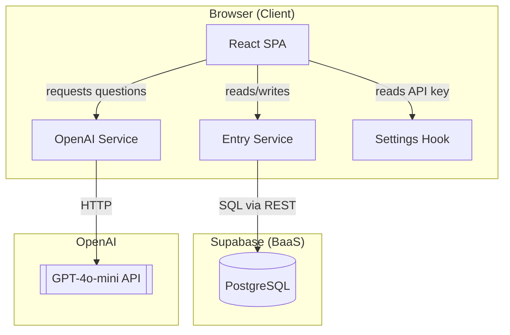
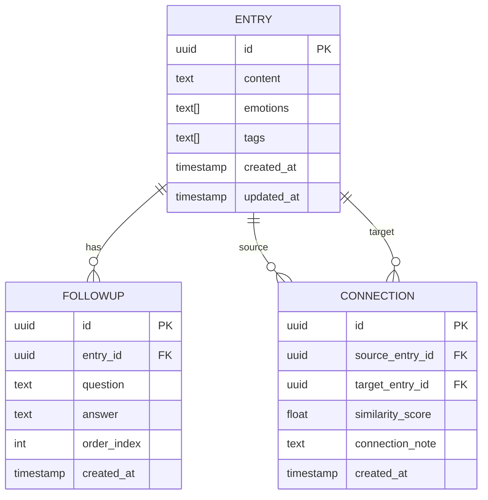
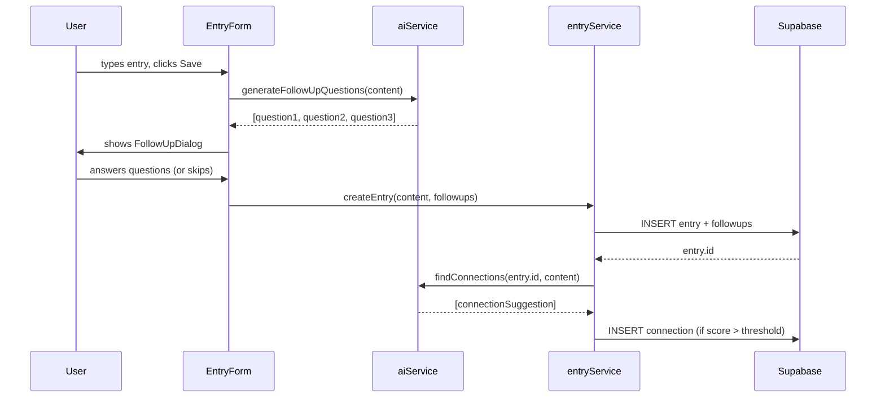
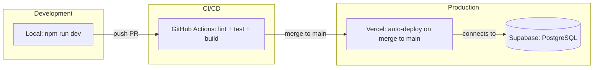

# Dotflow - Architecture Documentation

**Version:** 1.4
**Date:** 2026-04-23
**Author:** Solution Architect
**Status:** Updated after US-004

---

## 1. Architecture Overview (High-Level)



**Key Architecture Decisions:**
- **No backend server:** All logic runs in the browser. Supabase is the database, OpenAI is the AI. No Node.js server needed for MVP.
- **Single-user MVP:** No authentication. Supabase Row Level Security disabled. One Supabase project = one user.
- **API key in localStorage:** User provides their own OpenAI API key via Settings screen. Never sent to any server other than OpenAI.

---

## 2. Data Model — Entity Relationship Diagram (ERD)



**Notes:**
- `ENTRY.emotions` — array of detected/confirmed emotion tags (e.g., ["frustrated", "hopeful"])
- `ENTRY.tags` — array of topic tags (e.g., ["work", "relationship", "decision"])
- `CONNECTION.similarity_score` — 0.0 to 1.0, computed by AI when new entry is created
- `CONNECTION.connection_note` — AI-generated sentence explaining why entries are connected

---

## 3. Tech Stack

### Core Technologies

| Layer | Technology | Version | Rationale |
|-------|------------|---------|-----------|
| Frontend | React | 18 | Industry standard, large ecosystem, good for solo dev |
| Build tool | Vite | 5 | Fast HMR, simple config |
| Language | TypeScript | 5 | Type safety, better DX, fewer runtime errors |
| Styling | Tailwind CSS | 3 | Fast prototyping, no CSS files to manage |
| Database | Supabase | latest | PostgreSQL + REST API + realtime, generous free tier |
| AI | OpenAI GPT-4o-mini | latest | Fast, cheap, sufficient for follow-up questions and similarity |
| Hosting | Vercel | - | Zero-config deploy from GitHub, free tier |

### Key Dependencies

| Package | Purpose | Status | Documentation |
|---------|---------|--------|---------------|
| @supabase/supabase-js | Supabase client | ✅ Installed (^2.104.0) | https://supabase.com/docs/reference/javascript |
| openai | OpenAI SDK | 📋 Planned | https://platform.openai.com/docs |
| react-router-dom | Client-side routing | ✅ Installed (^7.14.2) | https://reactrouter.com |
| date-fns | Date formatting | 📋 Planned | https://date-fns.org |
| vitest | Unit testing | ✅ Installed (^2.1.3) | https://vitest.dev |
| @testing-library/react | Component testing | ✅ Installed (^16.0.0) | https://testing-library.com/react |

---

## 4. Folder Structure

```
dotflow/
├── src/
│   ├── components/          # Reusable UI components (planned)
│   │   ├── EntryForm/
│   │   ├── EntryList/
│   │   ├── EntryCard/
│   │   ├── FollowUpDialog/
│   │   └── ConnectionBadge/
│   ├── pages/               # Route-level components
│   │   ├── HomePage.tsx     # Home screen with entry list + warning banner (US-004)
│   │   └── SettingsPage.tsx # API key management screen (US-004)
│   ├── hooks/               # Custom React hooks
│   │   ├── useSettings.ts   # localStorage API key management (US-004)
│   │   ├── useEntries.ts    # (planned)
│   │   └── useAI.ts         # (planned)
│   ├── lib/                 # Third-party client initializations
│   │   └── supabase.ts      # Supabase client (US-002)
│   ├── services/            # External API integrations
│   │   ├── aiService.ts     # OpenAI API calls (planned)
│   │   └── entryService.ts  # Supabase CRUD (US-002)
│   ├── types/               # TypeScript type definitions
│   │   └── index.ts         # Entry, FollowUp, Connection, EntryWithFollowUps (US-002)
│   ├── utils/               # Pure utility functions (planned)
│   │   └── prompts.ts       # AI prompt templates
│   ├── __tests__/           # Tests mirror source structure
│   │   ├── setup.ts         # Vitest + jest-dom + RTL cleanup setup
│   │   ├── setup.test.ts    # TC-000: framework smoke test
│   │   ├── hooks/
│   │   │   └── useSettings.test.ts   # TC-019–022 (US-004)
│   │   ├── pages/
│   │   │   ├── HomePage.test.tsx     # TC-002, TC-024 (US-004)
│   │   │   └── SettingsPage.test.tsx # TC-001, TC-023 (US-004)
│   │   ├── services/
│   │   │   └── entryService.test.ts  # TC-012–018 (US-002)
│   │   └── utils/
│   │       └── testHelpers.tsx       # renderWithRouter helper
│   ├── App.tsx              # Root component with BrowserRouter + Routes (US-004)
│   ├── index.css            # Tailwind directives
│   ├── main.tsx
│   └── vite-env.d.ts
├── public/
├── docs/                    # Project documentation
├── .claude/
│   └── skills/              # Claude Code agent definitions
├── .github/
│   └── workflows/
│       └── ci.yml           # GitHub Actions CI pipeline (US-003)
├── .env.example
├── .gitignore
├── .prettierrc
├── eslint.config.js         # ESLint v9 flat config
├── index.html
├── package.json
├── postcss.config.js
├── tailwind.config.js       # Tailwind v3
├── tsconfig.json
├── vite.config.ts           # Vitest config (uses vitest/config import)
├── BACKLOG.md
├── CLAUDE.md
└── README.md
```

---

## 5. Component Architecture

### 5.1 EntryForm

**Responsibility:** Capture new journal entry text and handle the full entry creation flow (submit → AI questions → save).

**Flow:**
1. User types entry content
2. User submits
3. Component calls `useAI.generateFollowUpQuestions(content)`
4. FollowUpDialog renders with 2–3 questions
5. User answers (or skips)
6. Component calls `entryService.createEntry(content, followups)`
7. AI connection check runs in background

### 5.2 FollowUpDialog

**Responsibility:** Show AI-generated follow-up questions one at a time and collect answers.

**Key behaviors:**
- Maximum 3 questions
- Each question has "Skip" option
- "Ask me more" button (adds up to 2 extra questions)
- Does NOT block — user can always finish

### 5.3 EntryList

**Responsibility:** Display all entries chronologically. Show connection badges when relevant.

### 5.4 ConnectionBadge

**Responsibility:** Display a subtle "Connected to entry from [date]" link when AI finds similarity.

---

## 6. Data Flow

### 6.1 New Entry Creation



### 6.2 AI Follow-Up Question Generation

**Prompt strategy:** System prompt defines the role. User message contains the entry. AI responds with JSON array of questions. Questions are chosen based on what's MISSING from the entry:
- No emotion mentioned → ask about feelings
- No reflection mentioned → ask "what do you think about this?"
- No context → ask "what led to this?"

---

## 7. Security Considerations

### 7.1 API Key Handling
- OpenAI API key stored in localStorage (client-only)
- Key is sent only to `api.openai.com` — no proxy, no server
- Key is never logged or stored in Supabase
- User is warned in Settings UI: "Your key is stored locally on this device only"

### 7.2 Supabase
- Single-user MVP: RLS disabled, URL and anon key are safe to expose in frontend (standard Supabase pattern for anon key)
- Future: enable RLS + Supabase Auth when multi-user

### 7.3 Data Privacy
- All journal data stored in user's own Supabase project
- Content sent to OpenAI for AI features — user is informed in onboarding

---

## 8. AI Prompt Architecture

All prompts are centralized in `src/utils/prompts.ts`.

### Follow-Up Questions Prompt
```
System: You are a thoughtful journal companion. Your role is to ask 2-3 short, 
open-ended follow-up questions that help the user reflect more deeply. 
Focus on what's MISSING: emotions if not mentioned, opinions if not expressed, 
context if unclear. Never ask more than 3 questions. Respond only with a JSON 
array of question strings.

User: [entry content]
```

### Connection Detection Prompt
```
System: You are analyzing journal entries to find meaningful connections. 
Given a new entry and a list of past entries (max 10), identify if any past 
entry shares a meaningful emotional or situational pattern. Respond with JSON: 
{connected: boolean, entry_id: string|null, score: number, note: string}

User: New entry: [content]
Past entries: [array of {id, content, created_at}]
```

---

## 9. Deployment Architecture



---

## 10. Architecture Decision Records (ADRs)

### ADR-001: No Backend Server

**Date:** 2026-04-09
**Status:** Accepted

**Context:** Solo developer, MVP scope, single user. Adding a backend server adds deployment complexity, cost, and maintenance burden.

**Decision:** Call OpenAI and Supabase directly from the browser.

**Consequences:**
- Positive: Zero backend infrastructure, faster to build, free to run
- Negative: API key visible in browser (acceptable for personal use), future multi-user requires adding a backend proxy

---

### ADR-002: OpenAI User-Supplied API Key

**Date:** 2026-04-09
**Status:** Accepted

**Context:** No backend means no way to hide a shared API key. App is for personal use.

**Decision:** User provides their own OpenAI API key via Settings screen, stored in localStorage.

**Consequences:**
- Positive: No cost to developer, no key management, full user control
- Negative: UX friction (user must have OpenAI account), localStorage cleared = key lost

---

### ADR-003: Supabase over Firebase

**Date:** 2026-04-09
**Status:** Accepted

**Context:** Need a cloud database with sync. Both Firebase and Supabase work.

**Decision:** Supabase — PostgreSQL gives structured relational data (entries + followups + connections), better for complex queries needed for connection detection.

**Consequences:**
- Positive: SQL, proper relations, easy to query connections
- Negative: Slightly more setup than Firebase

---

## 11. Future Considerations

- [ ] Add Supabase Auth + RLS for multi-user support
- [ ] Add backend proxy for OpenAI (hide API key when multi-user)
- [ ] Add graph visualization view (D3.js or similar)
- [ ] Add mobile app (React Native, shared logic)
- [ ] Add semantic search using pgvector (Supabase supports this)
- [ ] Add weekly reflection summary (cron job via Supabase Edge Functions)

---

*This document is updated during /discover sessions when architectural changes are made.*
