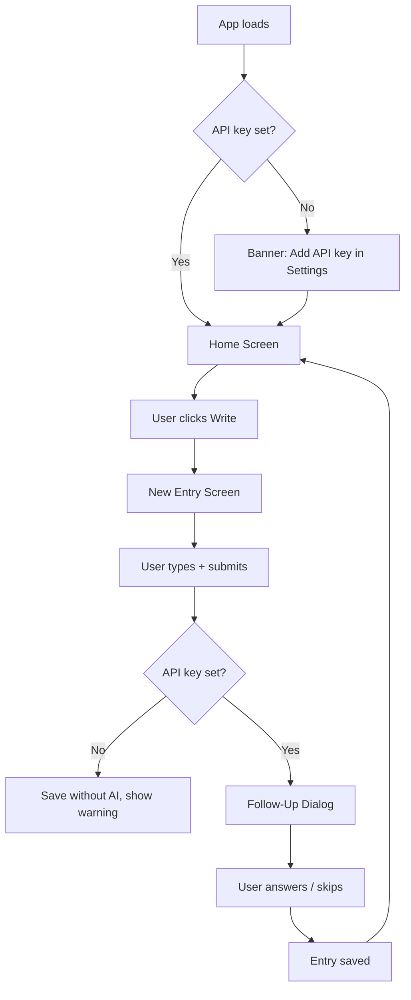
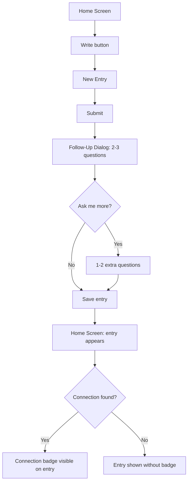
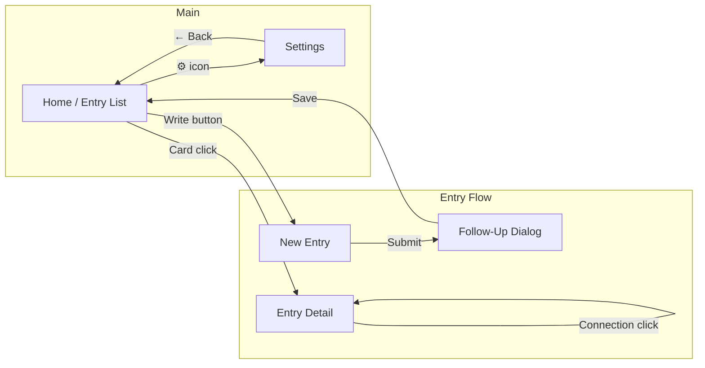

# Dotflow - Wireframes & Screen Flows

**Version:** 1.0
**Date:** 2026-04-09
**Author:** Solution Architect

---

## 1. Screen Inventory

| Screen ID | Screen Name | Purpose | Priority |
|-----------|-------------|---------|----------|
| S-001 | Home / Entry List | See all entries, navigate to write | MVP |
| S-002 | New Entry | Write a journal entry | MVP |
| S-003 | Follow-Up Dialog | Answer AI questions | MVP |
| S-004 | Entry Detail | Read full entry + Q&A | MVP |
| S-005 | Settings | Manage API key | MVP |
| S-006 | Graph View | Visualize entry connections | Post-MVP |

---

## 2. User Flows

### 2.1 First-Time User Flow



### 2.2 Returning User — Daily Entry Flow



---

## 3. Screen Specifications

### S-001: Home / Entry List

**Purpose:** Main screen. Shows all entries. Entry point to writing.

**Entry points:**
- App launch
- After saving entry
- After closing Settings

**Components:**
```
┌─────────────────────────────────┐
│  Dotflow              ⚙         │
├─────────────────────────────────┤
│                                 │
│  ┌─────────────────────────┐    │
│  │ 📅 Today, April 9       │    │
│  │ Had a frustrating meeting│    │
│  │ at work today...        │    │
│  │ 😤 frustrated  🏢 work  │    │
│  │ ── Connected: March 21 ─│    │
│  └─────────────────────────┘    │
│                                 │
│  ┌─────────────────────────┐    │
│  │ 📅 April 7              │    │
│  │ Feeling good about the  │    │
│  │ project direction...    │    │
│  │ 😊 hopeful  🚀 project  │    │
│  └─────────────────────────┘    │
│                                 │
│  [Empty state if no entries]    │
│                                 │
├─────────────────────────────────┤
│         [+ Write]               │
└─────────────────────────────────┘
```

**Elements:**
| Element | Type | Behavior |
|---------|------|----------|
| Entry card | Clickable card | Opens S-004 Entry Detail |
| Emotion tags | Badge | Display only |
| Connection badge | Clickable link | Scrolls to / highlights connected entry |
| Write button | Primary CTA | Opens S-002 New Entry |
| Settings icon | Icon button | Opens S-005 Settings |

**States:**
- Default: list of entry cards
- Empty: illustration + "Write your first entry" CTA
- Loading: skeleton cards

---

### S-002: New Entry

**Purpose:** Write a new journal entry.

**Entry points:**
- Write button on S-001

**Components:**
```
┌─────────────────────────────────┐
│  ← Back      New Entry          │
├─────────────────────────────────┤
│                                 │
│  What's on your mind?           │
│                                 │
│  ┌─────────────────────────┐    │
│  │                         │    │
│  │  [multiline textarea]   │    │
│  │                         │    │
│  │                         │    │
│  │                         │    │
│  └─────────────────────────┘    │
│                                 │
│  [character count / hint text]  │
│                                 │
│  ┌─────────────────────────┐    │
│  │        Save →           │    │
│  └─────────────────────────┘    │
│                                 │
└─────────────────────────────────┘
```

**Elements:**
| Element | Type | Behavior |
|---------|------|----------|
| Textarea | Text input | Free-form, no character limit |
| Save button | Primary button | Submits entry → triggers AI → opens S-003 |
| Back button | Icon | Discards draft, returns to S-001 |

**States:**
- Default: empty textarea
- Has content: Save button active
- Saving: loading spinner on Save button

---

### S-003: Follow-Up Dialog

**Purpose:** Show AI follow-up questions and collect answers.

**Entry points:**
- After submitting entry in S-002 (if API key set)

**Components:**
```
┌─────────────────────────────────┐
│  A quick question...            │
├─────────────────────────────────┤
│                                 │
│  "How did you feel when that    │
│   happened?"                    │
│                                 │
│  ┌─────────────────────────┐    │
│  │  [answer textarea]      │    │
│  └─────────────────────────┘    │
│                                 │
│  [Skip this question]           │
│                                 │
│  ┌─────────────────────────┐    │
│  │        Next →           │    │
│  └─────────────────────────┘    │
│                                 │
│  Question 1 of 2        ● ● ○  │
│                                 │
│  [Ask me more]  [I'm done]     │
├─────────────────────────────────┤
│  (Shown after all questions)    │
│  ┌─────────────────────────┐    │
│  │      Save Entry ✓       │    │
│  └─────────────────────────┘    │
└─────────────────────────────────┘
```

**Elements:**
| Element | Type | Behavior |
|---------|------|----------|
| Question text | Display | Shows current AI question |
| Answer textarea | Text input | Optional free-form answer |
| Skip link | Text button | Skips current question, no answer saved |
| Next button | Primary button | Saves answer, shows next question |
| Progress dots | Indicator | Shows current question position |
| Ask me more | Secondary button | Requests 1-2 additional questions (max total: 5) |
| I'm done | Text button | Finishes Q&A, shows Save Entry |
| Save Entry | Primary button | Saves entry + all answered follow-ups |

**States:**
- Questions loading: spinner with "Thinking..."
- Questions ready: question + answer form
- All questions done: "I'm done" + Save Entry visible
- Saving: spinner on Save Entry button

---

### S-004: Entry Detail

**Purpose:** Read a full entry with all follow-up Q&A.

**Entry points:**
- Clicking any entry card in S-001

**Components:**
```
┌─────────────────────────────────┐
│  ← Back      April 9, 2026      │
├─────────────────────────────────┤
│                                 │
│  Had a frustrating meeting at   │
│  work today. My manager kept    │
│  interrupting me...             │
│                                 │
│  😤 frustrated  🏢 work         │
│                                 │
├── Follow-up ────────────────────┤
│                                 │
│  Q: How did you feel when that  │
│     happened?                   │
│  A: I felt like my ideas        │
│     weren't being heard...      │
│                                 │
│  Q: What do you think about     │
│     this situation?             │
│  A: I think I need to talk to   │
│     my manager privately...     │
│                                 │
├── Connected to ─────────────────┤
│  ┌─────────────────────────┐    │
│  │ March 21 — "Another     │    │
│  │ meeting where I felt    │    │
│  │ unheard..."             │    │
│  │ [View entry →]          │    │
│  └─────────────────────────┘    │
│                                 │
└─────────────────────────────────┘
```

---

### S-005: Settings

**Purpose:** Manage OpenAI API key.

**Components:**
```
┌─────────────────────────────────┐
│  ← Back      Settings           │
├─────────────────────────────────┤
│                                 │
│  OpenAI API Key                 │
│  ┌─────────────────────────┐    │
│  │  sk-...xxxx             │    │
│  └─────────────────────────┘    │
│  [Change] [Clear]               │
│                                 │
│  ℹ️  Your key is stored locally  │
│  on this device only. Entry     │
│  content is sent to OpenAI      │
│  when AI features are used.     │
│                                 │
│  [Get an OpenAI API key →]      │
│                                 │
└─────────────────────────────────┘
```

---

## 4. Reusable Components

### 4.1 EntryCard

```
┌─────────────────────────────────┐
│ 📅 April 9, 2026                │
│                                 │
│ Had a frustrating meeting at    │
│ work today. My manager kept...  │
│                                 │
│ 😤 frustrated  🏢 work          │
│ ── Connected: March 21 ─────── │
└─────────────────────────────────┘
```

**Props:**
- entry: Entry (required)
- onTap: () => void (required)
- showConnection: boolean (optional)

---

### 4.2 EmptyState

```
┌─────────────────────────────────┐
│                                 │
│         ✦  ·  ·                 │
│        ·  ✦  ·  ✦               │
│                                 │
│    Your story starts here.      │
│  Write your first entry to      │
│  begin connecting the dots.     │
│                                 │
│      [Write first entry]        │
│                                 │
└─────────────────────────────────┘
```

---

## 5. Navigation Structure



---

## 6. Accessibility Notes

- [ ] All interactive elements have minimum 44x44 touch target
- [ ] Color contrast meets WCAG AA standards
- [ ] Screen reader labels defined for icon buttons (⚙, ←)
- [ ] Focus order is logical (entry form → questions → save)
- [ ] Skip question is keyboard accessible
- [ ] Loading states announced to screen readers

---

## 7. 3D Sky Mode — Screens (US-201+)

### S-007: 3D Sky — Ambient Mode (background)

The star field is a fixed CSS layer behind the entry list. Stars are blurred, not interactive.

```
┌─────────────────────────────────┐
│  [blurred star field behind]    │
│  ─────────────────────────────  │
│  Dotflow ●                 ⚙    │  ← logo = toggle
│  ─────────────────────────────  │
│  [entry list, z-10]             │
│  ┌─────────────────────────┐    │
│  │ April 9 — Tough meeting │    │
│  └─────────────────────────┘    │
│  [Write +]                      │
└─────────────────────────────────┘
```

### S-008: 3D Sky — Interactive Mode

Activated by clicking the Dotflow logo. Full-screen 3D canvas. Entry list hidden.

```
┌─────────────────────────────────┐
│  ✕ Exit 3D            [z-30]    │
│                                 │
│    ·  ✦  ·    ✦   ·             │
│  ✦      ●(black hole)   ·  ✦   │
│    ·  ✦          ✦   ·          │
│      ·  ✦  ·                    │
│                                 │
│  [OrbitControls: rotate/zoom]   │
└─────────────────────────────────┘
```

**Stars:** one per story. Color = emotion. Hover → tooltip (exclusive, one at a time).

**Black hole:** at `[0,0,0]`. Hover → insight tooltip. Click → InsightModal.

**Session lines:** thin purple line between stories from the same entry.

**Constellation lines:** `#D6D3D1` 50% opacity between connected stories.

---

### S-009: Story Star Tooltip (hover state)

```
┌─────────────────────────────────┐
│  [story text preview — 80 chars]│
│  [emotion badge] • [entry date] │
│                                 │
│  [Dopowiedz →]                  │
└─────────────────────────────────┘
```

- Max width 220px
- Appears after 300ms hover delay (one at a time globally)
- "Dopowiedz →" button opens StoryModal

---

### S-010: StoryModal

Opened by clicking a story star or "Dopowiedz →" in tooltip.

```
┌─────────────────────────────────┐
│  ‹                          ×   │  ← X closes modal (aria-label "Zamknij")
│  ─────────────────────────────  │
│  ● [emotion dot]  [date]        │
│                                 │
│  [story content — full text]    │
│                                 │
│  [Dopowiedz — add context]      │
│  ┌─────────────────────────┐    │
│  │  [elaboration textarea] │    │
│  │  [Zapisz →]             │    │
│  └─────────────────────────┘    │
│  ─────────────────────────────  │
│  ‹                           ›  │  ← sibling arrows (visible only when siblings exist)
└─────────────────────────────────┘
```

**Sibling navigation arrows:**
- `‹` (left): visible when `currentIndex > 0`
- `›` (right): visible when `currentIndex < siblings.length - 1`
- Small (24px hit target), Warm Stone color, secondary prominence
- No "2/5" indicator
- Clicking resets elaboration state and displays adjacent sibling

---

### S-011: InsightModal (black hole click)

Opened by clicking the black hole mesh.

**Initial state (not yet acknowledged):**
```
┌─────────────────────────────────┐
│  ─────────────────────────────  │
│  [holistic insight text]        │
│  — 1-2 sentences, temporal —    │
│                                 │
│  [Jest OK]        [Rozwiń]      │
└─────────────────────────────────┘
```

**After "Rozwiń" (elaboration loaded):**
```
┌─────────────────────────────────┐
│  [insight text]                 │
│                                 │
│  [elaboration text — 2-4 sen.]  │
│                                 │
│  ┌─────────────────────────┐    │
│  │  Twoje dopowiedzenie... │    │  ← textarea
│  └─────────────────────────┘    │
│  [To ma sens]   [Zapisz →]      │
└─────────────────────────────────┘
```

**After save (note persisted):**
```
┌─────────────────────────────────┐
│  [insight text]                 │
│  [saved note text]              │
│  Dobrze. Twoja refleksja...     │
│  [collapsible: Historia ▼]      │
└─────────────────────────────────┘
```

**History section (US-211 — planned, collapsible):**
```
┌─────────────────────────────────┐
│  Historia refleksji ▲           │
│  ─────────────────────────────  │
│  2 maja 2026                    │
│  Ostatnio dużo o pracy...       │
│  ─────────────────────────────  │
│  15 kwietnia 2026               │
│  Ten temat wraca od tygodni...  │
└─────────────────────────────────┘
```

Format: date + 1-2 sentence insight. No analytics. No dashboard. No scoring.

---

## 8. Tooltip System — Interaction Rules

| Rule | Value |
|------|-------|
| Max active tooltips | 1 |
| Activation delay | 300ms after `onPointerEnter` |
| Deactivation delay | 300ms after `onPointerLeave` (keepOpen grace period) |
| keepOpen duration (BlackHole) | 500ms |
| Override: new tooltip opens | Previous deactivates immediately |
| Override: cursor in tooltip div | keepOpen held (`isTooltipHovered`) |

See `docs/architecture.md` section 5.7a for technical rationale.

---

*This document is updated when UI changes are made during /discover or implementation.*
